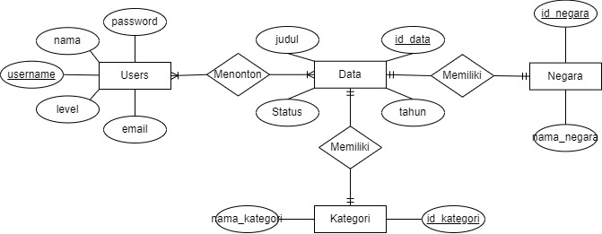

  <h2 align="center">
    Website MyStreamingList
    <h4 align="center">
    Website untuk listing, tracking, dan organizing daftar tontonan seperti film, acara TV, series, maupun drama
  </h4>
  </h2>

<!-- Daftar Isi -->

  
<h2 style="display: inline-block">Daftar Isi</h2>

  <ol>
    <li><a href="#anggota-tim">Anggota Tim</a></li>
    <li><a href="#fungsi">Fungsi</a></li>
    <li><a href="#tujuan">Tujuan</a></li>
    <li><a href="#target-pengguna">Target Pengguna</a></li>
    <li><a href="#mockup-kasar-sederhana">Mockup Kasar Sederhana</a></li>
    <li><a href="#skema-database">Skema Database</a></li>
    <li><a href="#lisensi">Lisensi</a></li>
  </ol>

<!-- Anggota Tim -->
## Anggota Tim
| NPM           | Nama             |
| ------------- |------------------|
| 140810210007  | Felicia Natania  |
| 140810210005  | Aliya Rahmania   |
| 140810210017  | Adinda Salsabila |

<!-- Fungsi -->
## Fungsi
Fungsi dari Website MyStreamingList ini adalah sebagai berikut:
 - Menambahkan judul film/acara TV/series/drama pada list yang bisa dikategorikan.
 - Menampilkan dan update judul film/series/drama juga tahun terbitnya.

<!-- Tujuan -->
## Tujuan
Tujuan dari Website MyStreamingList ini adalah sebagai berikut:
 - Memudahkan pecinta film/acara TV/series/drama dalam mengetahui judul mana yang  belum ditonton.
 - Memudahkan pecinta film/acara TV/series/drama  melihat history tontonannya. 
 - Mengingatkan pecinta film/acara TV/series/drama melalui notifikasi pada saat tanggal/waktu menunjukkan untuk menonton sesuai yang telah disetting masing-masing pengguna.

<!-- Target Pengguna -->
## Target Pengguna
Target pengguna dari Website MyStreamingList ialah semua orang yang memiliki hobi menonton khusunya bagi pecinta series/film agar dapat mengorganisir urutan tontonannya sehingga lebih mudah mengetahui tontonan yang belum ditonton.

<!-- Mockup Kasar Sederhana -->
## Mockup Kasar Sederhana
Berikut beberapa gambar yang menunjukkan rancangan antarmuka (interface) dari program yang ingin dibuat.

<!-- Skema Database -->
## Skema Database

<!-- Lisensi -->
## Lisensi

MIT License 2022
